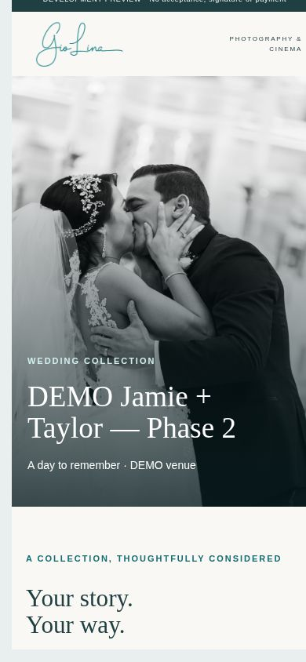
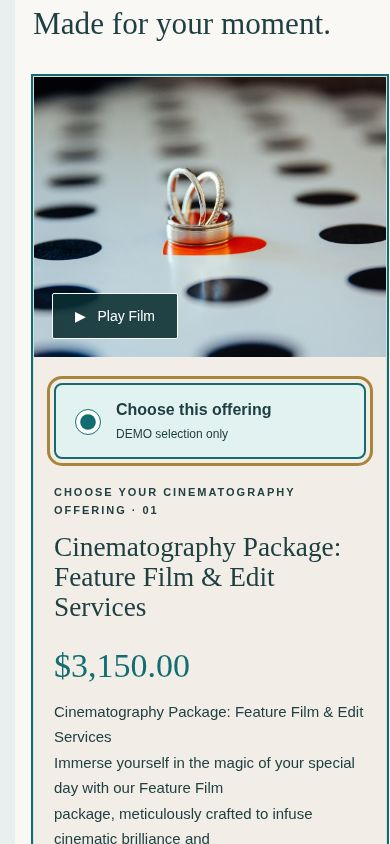
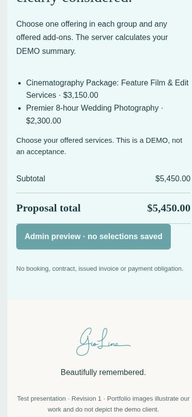
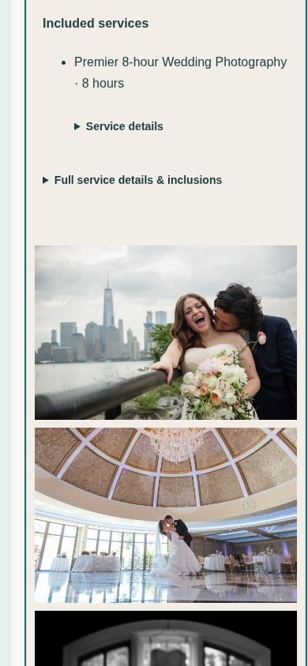
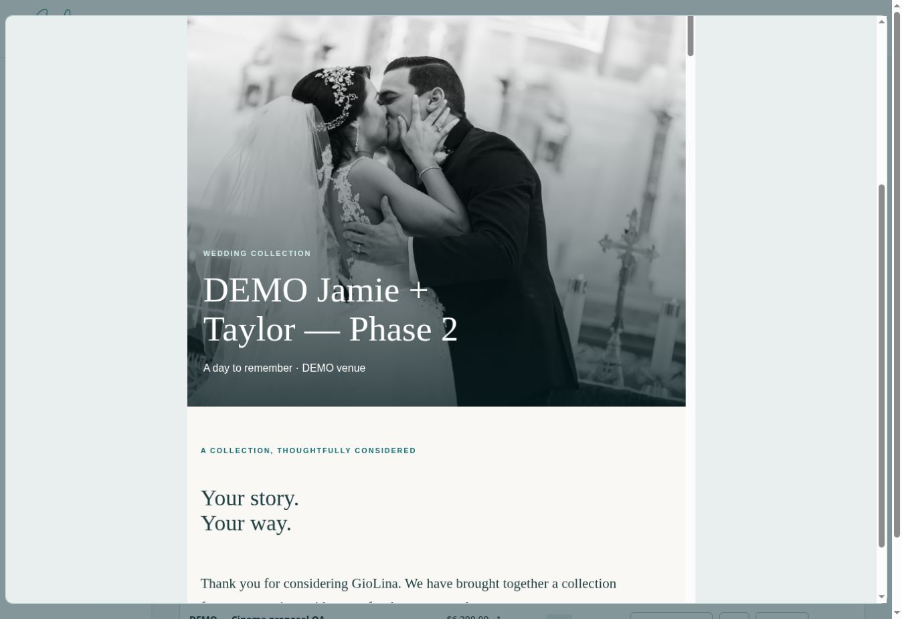
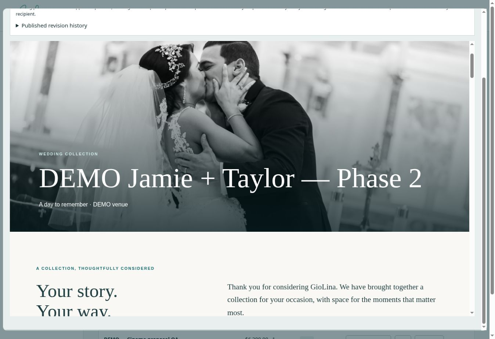
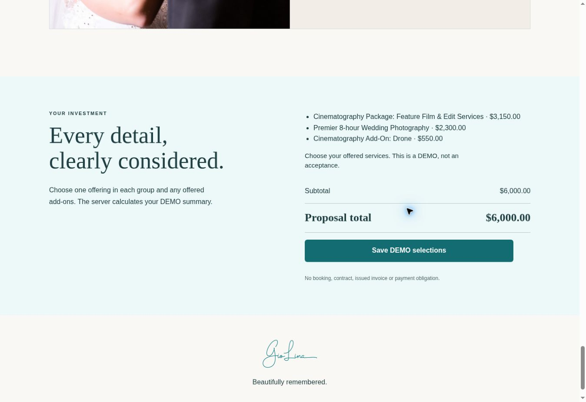

# GioLina Phase 2 review checkpoint — October 5, 2026

## Preserved before this phase

Existing Phase 1 Admin dashboard, contacts, projects, Activity / Files / Notes / Details, pipeline stages, source Service Library, proposal builder/presentations, draft invoices/manual schedules/history, portal foundation, Access/D1 security, and public-site playback/SEO improvements were recovered rather than rebuilt. Existing CRM rows and proposal links were retained.

## Completed in this phase

- Pointer-based Love in a Minute swipe separates horizontal gestures from vertical scrolling and suppresses the swipe-ending playback click. Intentional native playback requests sound; close destroys the player. Vimeo requests autoplay on the deliberate tap with muted=0 and playsinline=1. No scroll-triggered client film autoplay.
- Separate Service Library and Active Packages. Eight read-only baseline offerings use the exact recovered PDF names, prices and descriptions; duplicate for editable variants. Historical alternatives remain labeled for confirmation before real client delivery. Master edits do not alter saved proposal catalog/presentation snapshots.
- Synthetic preview inquiry ingestion with example.test-only emails, protected Admin access and idempotent request references. Structured manual Leads remain supported. Leads inherit context into Projects, deduplicate matching contacts within DEMO boundaries, support association to a matching existing Project and retain history. Proposals created before conversion carry into the resulting Project.
- Template chooser from Lead/Project, offered package groups, included items, optional add-ons, per-proposal overrides and discounts. Admin controls the offer; no wholesale public Service Library.
- DEMO client selection: one package per offered group, permitted add-ons, server-priced summary, explicit Save DEMO selections, version/conflict checks, expiry/revocation and audit history. Client sends indices, not prices. Selection produces no booking, contract, invoice or payment obligation.
- Individual template previews, direct protected record links, lead proposal/history references, first DEMO-view audit event, mobile Admin cards/navigation and inactive next-step placeholders.

## Demonstrated workflow

**Synthetic preview inquiry → Lead → Project → Active Package → proposal snapshot → DEMO choices/add-ons → trusted updated summary.**

This is a safe simulation of the future website ingestion step. The production public Contact form still submits to Formspree and does **not** automatically create CRM Leads. Production inquiries require manual entry today.

Wedding: cinema $3,150 + photo $2,300 = $5,450. Adding the source $550 drone produced $6,000, saved and persisted after reload. A separate proposal offered 8-hour and Micro Wedding alternatives: Micro cinema $1,700 + Micro photo $1,500 = $3,200, incompatible add-ons disabled and selection persisted after reload.

Sweet Sixteen: 6-hour photography $1,650 + cinema $1,800 = $3,450; the permitted $100 gallery add-on produced $3,550 and persisted after reload. These are sums of individually offered source services, not newly invented branded combination packages.

## Review destinations

All destinations use the existing preview only. Admin links require Cloudflare Access.

| Area | Hosted destination |
| --- | --- |
| Leads | https://preview-homepage-photography-rotation-giolina.dawn-math-f4b1.workers.dev/admin/leads/ |
| Representative Project | https://preview-homepage-photography-rotation-giolina.dawn-math-f4b1.workers.dev/admin/projects/?record=2ed42a51-1055-4cdf-8a0c-32fc13d7bfa9 |
| Active Packages | https://preview-homepage-photography-rotation-giolina.dawn-math-f4b1.workers.dev/admin/packages/ |
| Proposal Builder | https://preview-homepage-photography-rotation-giolina.dawn-math-f4b1.workers.dev/admin/proposals/ |
| Wedding choices DEMO | https://preview-homepage-photography-rotation-giolina.dawn-math-f4b1.workers.dev/proposal/eee4a96909b75468371c5e356e436dd93f1414e974feeb2ec9abf57a059f1333 |
| Sweet Sixteen DEMO | https://preview-homepage-photography-rotation-giolina.dawn-math-f4b1.workers.dev/proposal/b759913392cfd5f2861bffddad6da98f4badd5b660958329a1a03376e2d80a31 |
| Draft invoices/manual payments | https://preview-homepage-photography-rotation-giolina.dawn-math-f4b1.workers.dev/admin/invoices/ |
| Portal foundation | https://preview-homepage-photography-rotation-giolina.dawn-math-f4b1.workers.dev/admin/client-portal/ |

Public DEMO links expire after 30 days and can be revoked/regenerated in Admin; anyone holding one can review and change that isolated DEMO selection. They contain no private notes, email addresses or client account grants.

## Hosted proposal evidence

Cloud Chromium hosted iframe viewports: 390 × 844, 430 × 932, 768 × 1024, 1024 × 768 and 1280 × 760. Document scrollWidth equaled clientWidth at every tested size (classic scrollbar excludes 15px from content width). Hero names wrap fully, package cards stack with large selection controls, galleries fit and totals remain readable. This verifies layout in hosted responsive viewports, not physical iPhone/iPad/Safari certification. Admin phone/tablet physical acceptance remains open.

The screenshots show the protected preview canvas with the same proposal rendering; its Save button is intentionally inactive. Actual public DEMO saves were separately verified through the client links above.

## Public inquiry CTA audit

Compiled from current built pages; no forms submitted and no public delivery behavior changed.

| Location | Meaningful CTA labels | Destination |
| --- | --- | --- |
| Site header/navigation/footer | Inquire about your day; Contact Us | /contact-us-2/ |
| Home hero and closing | Inquire | /contact-us-2/ |
| Photography | Let’s talk photography | /contact-us-2/ |
| Cinematography | Inquire about your film | /contact-us-2/ |
| Sweet Sixteen | Let’s plan your celebration; Tell us what you have in mind; Ask About Photography & Cinematography; Ask About Sweet Sixteen Coverage; Send an inquiry; Inquire about your celebration | /contact-us-2/?occasion=sweet-sixteen |
| Experience | Let’s talk about your day; send us an inquiry; Inquire about your wedding | /contact-us-2/ |
| About | Inquire about your wedding | /contact-us-2/ |
| Events | Contact; Let’s talk about your event; Start a conversation | /contact-us-2/ |
| Events photo-film / private-celebrations / live-events | Contact; Tell us about your event; Let’s talk | /contact-us-2/ |
| Reviews | Shared site inquiry/navigation/footer CTAs | /contact-us-2/ |
| Contact form | Send inquiry | https://formspree.io/f/xbglbbpo |
| Footer, Contact, Sweet Sixteen, Experience | Schedule a consultation / conversation | https://clients.giolina.co/schedule/61f5ca5de95956002dd1c3d7 |
| Footer / Contact | Email and phone | mailto:info@giolina.co; tel:8663060308 |
| Ready To Go Productions | Contact; Let’s discuss your production; Start a conversation | mailto:info@giolina.co?subject=Ready%20To%20Go%20Productions%20inquiry |

Safest future ingestion: retain Formspree as the email-delivery source; a verified server-side delivery adapter can map successful Formspree submissions into organization-scoped Leads with deduplication/idempotency, provenance and retry monitoring. Provider payload/authentication and duplicate handling must be confirmed before production activation. Avoid a browser double-submit that could report success while losing either delivery. No webhook or production adapter was activated here.

## Presentation identity audit retained

| Page | Displayed identity | Presentation image | Exact destination | Verified destination identity |
| --- | --- | --- | --- | --- |
| Photography | Stephanie & Danny | None in the simple delivery-link band | https://clients.giolinafilms.com/StephanieDanny/Wedding | Stephanie + Danny |
| Cinematography | Ally & James | None in the simple delivery-link band | https://mediazilla.com/FY22EfWIt8 | Ally + James; expanded Alexandria name was not verifiable |

The prior image-led Cinematography feature was removed in the preceding correction pass. No unverified Alexandria/image pairing was reintroduced.

## Still unresolved / Frank review

- Physical iPad/Safari footer gap.
- Real-device Admin phone/tablet visual acceptance and client proposal mobile acceptance.
- Physical Safari one-tap audible playback/swipe acceptance, especially hosted Vimeo/MediaZilla embeds. Native unmuted playback and complete unload were observed in cloud Chromium; autoplay policy remains a device/provider testing item.
- Christina & Danny and Stephanie & Danny authentic matching shorts.
- Deanna & Anthony and Lauren & Tommy authentic bytes are supplied/verified; production-quality hosting/upload destinations are still needed. Exact files are `deanaAnthony_instaCut_v03_published.mp4` and `1minuteClientRecap_LaurenTommy_1920x1080_published(1).mp4`. They exceed the Workers static asset limit; no substitute or guessed destination was used.

Frank should review the source baselines/historical alternatives, presentation visuals, allowed add-ons, mobile readability and workflow navigation. An approved hosting destination for the two authentic shorts and approval of a future production inquiry adapter are decisions remaining; no payment-provider choice is required now.

## Deferred

Live inquiry ingestion activation, real proposal delivery, client account authentication, completed questionnaires, binding contracts/e-signatures, issued invoices, payments/receipts/refunds, outbound correspondence and full portal remain later-phase work. Draft invoice lines, schedules and manual bookkeeping remain intact. HoneyBook still handles scheduling, correspondence, contracts, payments and client history.

No production deployment, DNS/routing/email/client-domain changes, payment/signature activation, real-client messages or Search Console changes occurred.
